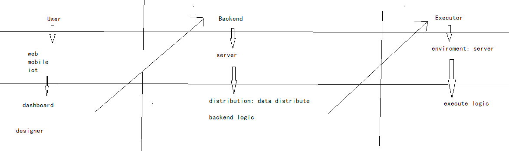

[TOC]

# 基本思路

数据+指令

一看觉得可能是指令比较牛逼, 例如部署各种运维系统, 修改各种配置文件进行配置、调优, 但是没有数据就没办法使用以及形成体系

所以我觉得可以先做数据, 先初步描绘再初步指令实现功能

整体分为三层, 用户层、后台层、执行器层, 其实都可以分为三个项目, 但是现在为了简便就不那样做了, 分离之后确实方便管理, 但是我现在并不需要管理

# 用户层

## dashboard(看、编排、使用)

## designer(写)

# 后台层

### backend logic

deal with problem

store data

### distribution

store command

# 执行器层

execute logic, logic be component by command  + data

