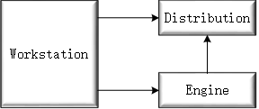
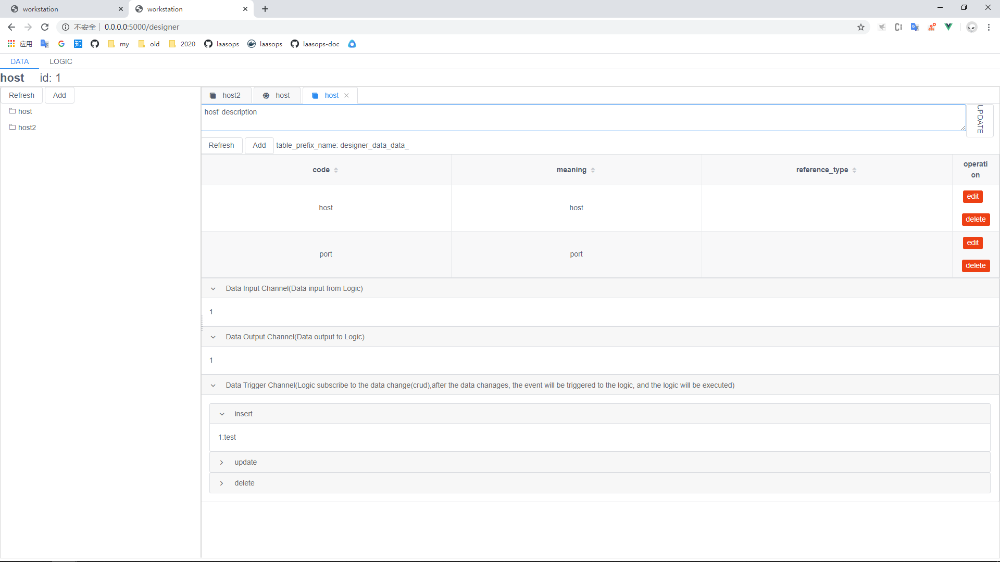
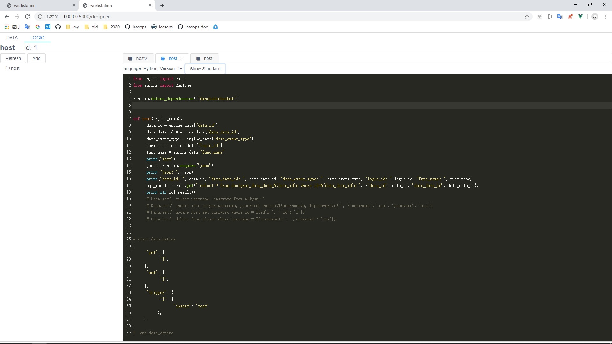
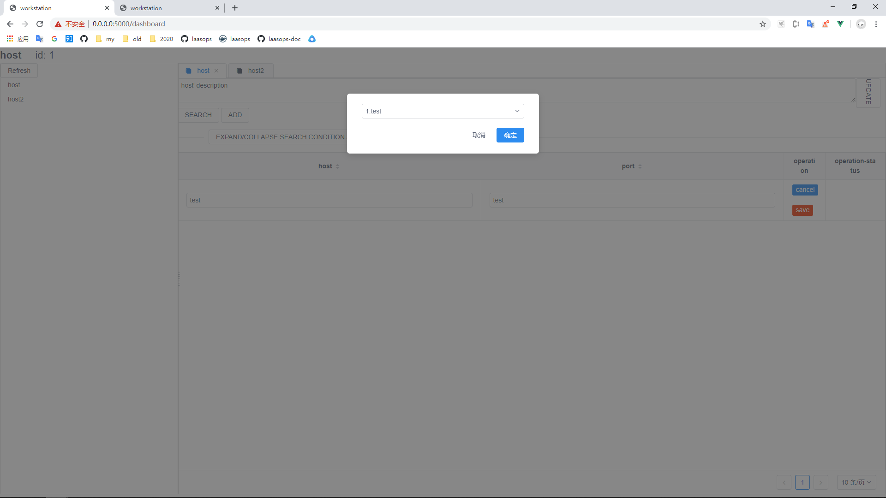
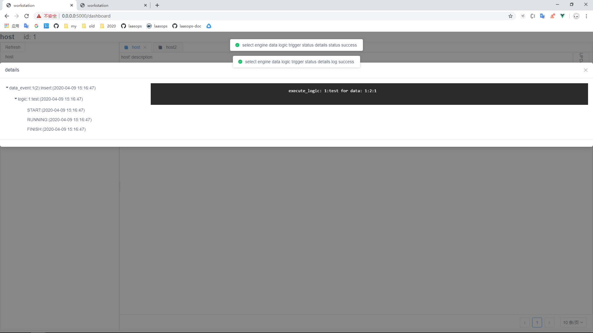

# 总体来说

从数据的角度驱动由分发、组装由数据和指令库构造的逻辑

Workstation -> Distribution

Workstation -> Engine

Engine		   -> Distribution

# LaasHub 组成元素

## 工作站	

### 设计器

#### Data

##### 形状

##### 描述

##### 属性

###### 属性名

###### 属性类型(基本/引用)

###### 属性约束

###### 默认值

##### 包含类

##### 输入/输出管道

##### 版本化、可复制

##### 套版

#### Command/Logic

##### 描述

##### 语言:版本:依赖包

##### 输入数据

##### 输出数据

##### 订阅数据

##### 触发数据

##### 版本化、可复制

### 面板

#### 数据面板

##### 数据操作(编排)

##### 数据展示

###### 套版

###### 拓扑

##### 数据状态

###### 日志

###### 监控

###### 告警

###### 自愈

#### 用户面板

##### 用户

##### 角色

##### 流程

##### 权限

## 分发库

分发器分发逻辑业务

## 执行引擎

引擎执行逻辑业务

# 产品文档

## [点击打开在线体验](http://129.211.59.74)

## 目前进度

