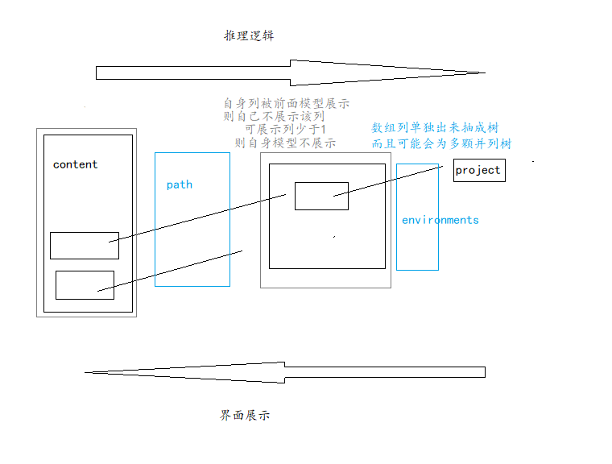

通过数据类型加深数据展示层次

通过关联数据模型串联关系

# 数据模型设计

## 数据: 配置项目数据

名称

## 数据: 配置项目部署环境数据

​	有哪些项目

​		项目名称	项目路径	项目环境(默认: dev,stage,pre,prod)

```
project_id
environments: dev,stage,pre,prod
```

## 数据: 配置项目配置文件数据

​	项目

​	环境

​	配置文件路径

​		对比其他环境

​		配置文件历史信息

​		合并到其他环境

​	配置文件内容

```
id
environment
path
content
```

## 开放数据

服务连接数据

# 数据模型

## 项目(project)

| 字段 | 类型   | 默认值 | 含义     | 关联模型 |
| ---- | ------ | ------ | -------- | -------- |
| name | string |        | 项目名称 |          |

## 项目环境(project_environment)

| 字段         | 类型        | 默认值             | 含义     | 关联模型 |
| ------------ | ----------- | ------------------ | -------- | -------- |
| project      | string      |                    | 项目     | project  |
| environments | list_string | dev,stage,pre,prod | 环境列表 |          |

## 项目配置文件(project_configuration_file)

| 字段                | 类型        | 默认值 | 含义 | 关联模型            |
| ------------------- | ----------- | ------ | ---- | ------------------- |
| project_environment | string      |        | 环境 | project_environment |
| path                | path_string |        | 路径 |                     |
| content             | file_string |        | 内容 |                     |

查询指定模型时会先查询关联模型, 关联模型之前会先进行排序

查看历史版本, 对比历史版本, 从历史版本拉取到本地


# 案例数据

## 项目

| 项目      |
| --------- |
| project_1 |

## 项目-环境

| 项目      | 环境               |
| --------- | ------------------ |
| project_1 | dev,stage,pre,prod |

## 配置文件

| 项目      | 环境 | 路径          | 内容 |
| --------- | ---- | ------------- | ---- |
| project_1 | dev  | test/test.txt | test |

