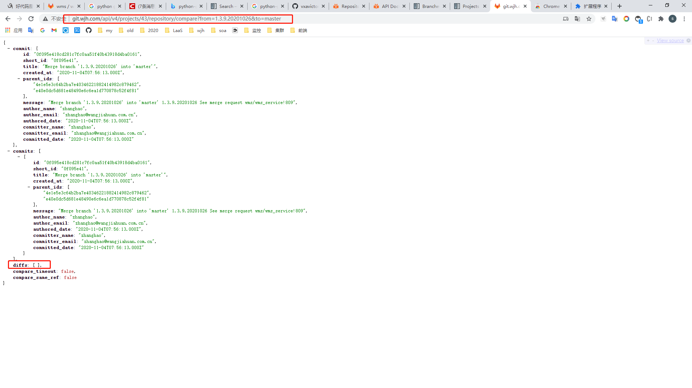

# 为什么要解决这个问题

目前在做统一运维系统

一些配置数据没有收拢起来

研发流程很重要, 一切的源头

# 目前情况(乱)

使用git进行源码管理

使用master分支作为开发分支

使用ci_dev、ci_test、ci_stage依次为自动构建的开发、测试、生产分支, 由于git分支是没有权限锁定的, 所以开发人员等可以根据情况修改

流程审核之后自动合并覆盖提交上一分支的代码到下一分支, master>ci_dev>ci_test>ci_stage

feature分支、hotfix分支

开发环境代码自动同步：

配置项目开发分支, 监控代码提交动作, 当提交时自动去编译构建镜像并推送, 更新服务器上开发环境的代码版本

针对功能拉功能分支1出来进行开发-测试, 然后合并到master分支

合并多个feature-1+2到merge分支

merge分支和master分支的区别:

​	merge包含不被发布

​	master对应生产环境代码

release

master分支->tag->tag

feature ->

master <- feature

feature-1 -> master

featrue-2 -> master

master 不稳定 -> merge

release 生产 -> master

feature-1

feature-2

hostfix-1

master

# 规范后的git工作流协作方式

基于master分支拉出功能分支(feature-n)进行开发

开发确定提测功能分支, 当提测功能分支多个时, 自动合并为一个新的功能分支

开发提测功能分支


测试进行功能分支测试

运维系统更新功能分支测试环境服务版本

功能测试未测试通过时, 协商开发定义并记录测试遇到的问题, 结束流程

功能需求测试测试通过时, 进行集成测试

运维系统更新集成测试环境服务版本

​		自动检测功能分支的代码版本是否大于master

​				当功能分支的代码版本小于master时, 通知开发合并master分支到功能分支并重新提测

​				当功能分支的代码版本大于master时, 自动覆盖合并该功能分支到master分支

如果集成测试未通过, 协商开发定义并记录测试遇到的问题, 自动回滚master分支到上一次提交点

如果集成测试通过, 自动同步更新线上版本为测试版本, 通知其他同时开发的功能分支人员进行合并master分支到到各自的功能分支代码

运维系统更新生产环境环境服务版本


如果线上问题大则直接回滚, 换成上一个部署版本

如果线上问题不大但是很紧急则提出线上问题, 继续走上面的功能开发流程并标注为紧急问题修复, 在原来功能分支上进行修复或者在最后一次合并的功能分支上进行修复, 终止并回滚集成测试, 接入该修复标签的功能测试分支进行集成测试


# 版本2

基于master分支拉出v(n)长期分支, 拉出v(n)/feature/n功能分支, 拉出v(n)/hotfix/n问题分支, 拉出v(n)/optimizate优化分支

需要配置记录住线上的是v几以及长期灰度环境的版本列表是哪些v几

按照版本进行交付, 尽量缩小范围进行交付(敏捷交付)

使用v(n)/hotfix分支修复bug, 使用v(n)/feature分支新增小版本需求

最终合并到v(n)分支, 拉tag构建


解决合并代码时缺少合并分支的问题:

产品经理编写需求列表

开发认领需求并附上项目+分支名列表, 开发进行开发

上线时通过对比分支中的文件内容方式实现检查包中合并的分支名列表

暂时可以通过腾讯文档去记录这种数据, 我可以提供工具去自动对比功能分支与主分支的文件差异

```
浏览器访问:

http://git.wjh.com/api/v4/projects/43/repository/compare?from=1.3.9.20201026&to=master
http://git.wjh.com/api/v4/projects/<仓库id>/repository/compare?from=<分支>&to=<源分支>

查看界面响应:
查看 diffs: [ ], 中的内容, 如果为空数组则说明是没有冲突的
```




定时归档分支

是否分支fetch源分支取决于是否有冲突


临时方案


