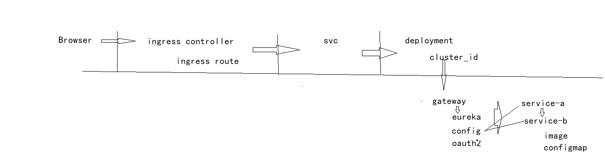
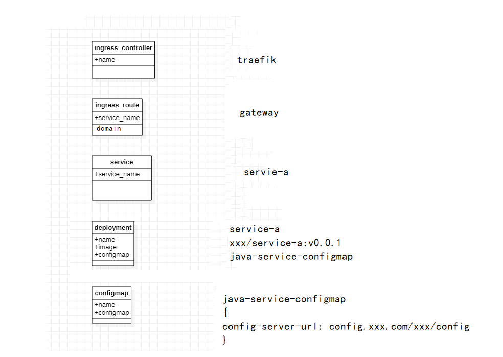
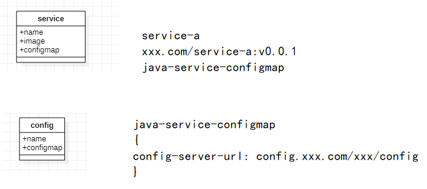

[toc]

# 现代化运维平台建设的艺术与务实

## 简单案例

以一个java springcloud项目 运维在kubernetes为案例来描述一下需要做什么以及实现什么效果

假设我们需要运维一个java的微服务集群(springcloud体系)

假设前面ci已经做好了, 基于gitlab-ci, 每次提交都会直接构建一个镜像并推送到镜像仓库

假设已经做好基础搭建了, 接下来做springcloud项目部署到kubernets中

假设springcloud项目中有eureka(服务注册中心)、springcloud-config(服务配置中心)、springcloud-gateway(服务网关)、service-a(服务A)、service-b(服务B)

在kubernetes中需要使用ingress、svc、configmap、deployment

我们先按照反推思路去做, 运维效果如下:

转换成表如下:

再次简化为:

关注数据变动service-name和image和config其实就可以看到运维形态了

当service模型发生变动时触发service指令, service指令检查数据发生了哪些变化, 如果服务名称是新加的, 便创建一遍svc/deployment, 如果是修改便修改修改该套的中对应的数据, 一般频率高的地方是image和config中的数据, 修改config对于无感知项目来说是需要重启的

通过开放数据、工单(用户、角色、权限、流程)、指令其实可以极度简化工作, 你就会发现运维专注起来之后其实非常轻松

## 思路

通过抽象分层形成分层模型, 具体化每一个组件形成组件模型

尽可能的使用抽象分层模型, 抽象分层模型是基于组件模型, 通过多次反复调整实现满足业务

模型都要对应到指令, 指令和数据思路是一致的